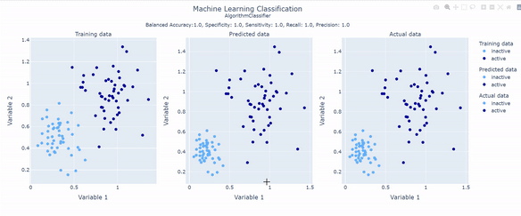

# Machine Learning Visualization graph

This jupyter code was created to share the model of a graph to present the results of a Machine Learning Classification model. 

 

&nbsp;

## Libraries used

* [pandas](https://pandas.pydata.org/) - a Python package that provides fast, flexible, and expressive data structures designed to make working with "relational" or "labeled" data both easy and intuitive. 

* [NumPy](https://numpy.org/) -  the fundamental package for array computing with Python

* [scikit-learn](https://scikit-learn.org/stable/) - Machine Learning in Python.

* [plotly](https://plotly.com/) - The front end for ML and data science models

&nbsp;

## Instalation

pandas:
```
pip install pandas
```
numpy
```
pip install numpy
```
scikit-learn
```
pip install scikit-learn
```
plotly
```
pip install plotly
```

&nbsp;

## Observations

**This code was written by searching in different sources but mostly two answers in stackoverflow helped a lot:**

* [scatter-plot-markers-different-colors-based-on-value](https://stackoverflow.com/questions/67162389/scatter-plot-markers-different-colors-based-on-value)

* [plotly-how-to-customize-legend](https://stackoverflow.com/questions/56871095/plotly-how-to-customize-legend)

&nbsp;

## Authorship

* Author: **Brenda Ferrari** ([brendaferrari](https://github.com/brendaferrari))

Social preview original photo by **Brenda Ferrari** ([brendaferrari](https://github.com/brendaferrari))